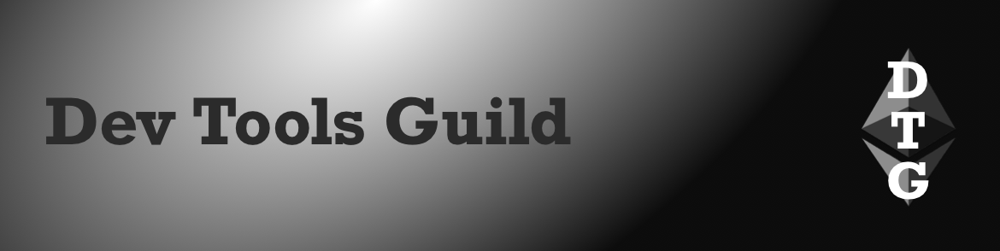

Roman Storm found guilty of unlicensed money transmitting charge, ePBS & Block-level Access Lists selected as Glamsterdam upgrade headliners

### All core devs (main protocol calls)

#### All core devs \- execution (ACDC) [\#162](https://ethereum-magicians.org/t/all-core-devs-consensus-acdc-162-august-07-2025/24919/2)

* [Fusaka](https://forkcast.org/upgrade/fusaka) upgrade:  
  * Consensus layer teams need until end of September for client releases due to code readiness concerns (merging to trunk branches)  
  * Timeline tight for mainnet upgrade before Devconnect   
* [Glamsterdam](https://forkcast.org/upgrade/glamsterdam) upgrade:  
  * [Stakeholder feedback](https://efdn.notion.site/Stakeholder-feedback-synthesized-247d9895554180048a8bd279a28798a1) summarized  
  * Headliners selected: [EIP7732](https://forkcast.org/upgrade/glamsterdam#eip-7732) ePBS (consensus layer) & [EIP7928](https://forkcast.org/upgrade/glamsterdam#eip-7928) Block-level Access Lists (execution layer), set to Scheduled for Inclusion (SFI)  
  * [EIP7805](https://forkcast.org/upgrade/glamsterdam#eip-7805) FOCIL remains as Considered for Inclusion (CFI)

#### All core devs \- testing (ACDT) [\#47](https://ethereum-magicians.org/t/all-core-devs-testing-acdt-47-august-4-2025/24956/2)

* [Fusaka](https://forkcast.org/upgrade/fusaka) upgrade:   
  * [Fusaka-devnet-3](https://fusaka-devnet-3.ethpandaops.io/) testing ongoing    
  * [EIP7825](https://forkcast.org/upgrade/fusaka#eip-7825) 16.8M transaction gas limit cap: not increasing cap  
  * PeerDAS balance per additional custody group: too late to increase in Fusaka  
  * [🦓](https://x.com/nixorokish/status/1952819749228093800) selected as mascot

### Layer 1

* [Fusaka](https://forkcast.org/upgrade/fusaka) upgrade:  
  * [Fusaka-devnet-4](https://fusaka-devnet-4.ethpandaops.io/) live: 1.5k nodes with 43.5k validators, \~10% size of mainnet 
* [Glamsterdam](https://forkcast.org/upgrade/glamsterdam) upgrade:  
  * [EIP7732](https://forkcast.org/upgrade/glamsterdam#eip-7732) ePBS:   
    * Flashbots: [free option problem quantified](https://collective.flashbots.net/t/the-free-option-problem-in-epbs-part-ii/5145), realized option value is low (4 ETH) on average days but high (\>40ETH) on abnormal volatility days  
* Toni Wahrstätter: [gas refunds for resetting a slot to zero](https://ethresear.ch/t/overclocking-blocks-with-gas-refunds/22862) distort block gas accounting  
* EIPs:  
  * [EIP7997](https://github.com/ethereum/EIPs/pull/10092/files): Multi-chain deterministic deployment factory  
  * [EIP7998](https://github.com/ethereum/EIPs/pull/10093/files): Turn randao\_reveal into a VRF  
  * [EIP7999](https://github.com/ethereum/EIPs/pull/10100/files): Unified multidimensional fee market

### Staking

* Lido [CSM vulnerability mitigated](https://research.lido.fi/t/security-disclosure-post-mortem-csverifier-weak-validation-of-the-historical-block-gindex-user-funds-remain-safe/10466) via offchain oracle improvements & modification to v1 onchain code  
* [Client diversity](https://clientdiversity.org/#distribution):  
  * Consensus layer: Lighthouse 42.7%  
  * Execution layer: Geth \~41%, Nethermind \~38% (estimated from 74% self reported)  
* [Staking marketshare](https://dune.com/hildobby/eth2-staking): Lido 24.6%  
* Client releases:  
  * Consensus layer  
    * Lodestar [v1.33.0](https://github.com/chainsafe/lodestar/releases/tag/v1.33.0): libp2p upgrade, proposer boost reorg enabled by default & fixes older CPU compatibility  
  * Execution layer  
    * Geth [v1.16.2](https://github.com/ethereum/go-ethereum/releases/tag/v1.16.2): Fusaka upgrade EIP implementations, optimizations & fixes

### Layer 2

* Vitalik: [fast withdrawals](https://x.com/VitalikButerin/status/1953131251436818684) (via validity proof systems) more important than stage 2  
* L2 Interop working group [\#12](https://notes.ethereum.org/@rudolf/interop-12)  
* [Kona-node](https://blog.oplabs.co/introducing-the-kona-node-a-rust-powered-leap-for-the-op-stack/) (OP Stack): Rust based node implementation  
* Spire [DA builder](https://x.com/Spire_Labs/status/1953505023759151148) (blob aggregator): live on mainnet  
* Base [33 minute network disruption](https://status.base.org/incidents/kdq3t8s13gfs), due to automatic handoff to unhealthy sequencer which was unable to initiate another handoff

### Research

* Vitalik: [early exploration to reduce slot time](https://ethresear.ch/t/lmd-ghost-with-256-validators-and-a-fast-following-finality-gadget/22856), LMD GHOST using \~256 randomly selected validators with a separate fast-following finality gadget using all active validators

---

### Sponsor: [Dev Tools Guild](https://devtoolsguild.xyz)

  

The Dev Tools Guild unites critical Ethereum developer tooling to collectively fund projects and their maintainers (think Protocol Guild but for dev tooling), and boost coordination between protocol and dev tools developers. 

Member projects:

* **Smart contract languages**: Solidity & Vyper  
* **Client libraries**: alloy, ethers.js, Nethereum, viem, web3.py & Web3j  
* **Frameworks and developer environments**: Ape, Foundry & Scaffold-ETH  
* **Standardization tooling**: Sourcify

Follow [@devtoolsguild](https://x.com/devtoolsguild), Visit [devtoolsguild.xyz](http://devtoolsguild.xyz), Fund at [donate.devtoolsguild.eth](https://devtoolsguild.xyz/donate)

---

### Ecosystem

* Science of Blockchain Conference [session videos](https://www.youtube.com/playlist?list=PLS01nW3RtgorIUziK9tBT9ybvuUw38kD0)  
* ethereum.org [Translatathon](https://ethereum.org/en/contributing/translation-program/translatathon/)  
* ETH metrics:  
  * [Gas](https://ultrasound.money/#gas) (gwei): 0.5 average, 0.1 \- 11.0 (16.3 for zero net issuance)  
  * [ETH supply change](https://ultrasound.money/): 18k net issuance  
  * [ETHUSD](https://www.coingecko.com/en/coins/ethereum): $3,381 – $3,931 (all time high $4,878, November 10, 2021\)  
  * [ETHBTC](https://ratiogang.com/): 0.033 (0.165 for the Flippening)

### Developers

* Hardhat [v2.26.2](https://github.com/NomicFoundation/hardhat/releases/tag/hardhat%402.26.2): improved stability across Node.js versions  
* Remix:   
  * [v0.69.0](https://medium.com/remix-ide/remix-release-v0-69-0-955999227990): improved UI  
  * [Desktop](https://github.com/remix-project-org/remix-desktop#readme): Electron version for Linux, Windows & Mac  
* Solx [0.1.1](https://x.com/solx_compiler/status/1951295228775899218) beta: faster compilation and gas & bytecode size improvements  
* ETHID [MCP](https://ethidentitykit.com/docs/ai-tools/ethid-mcp): use AI with Ethereum Follow Protocol (EFP), Ethereum Name Service (ENS), Sign in with Ethereum (SIWE) & Ethereum Identity Kit  
* Privy: [using Base sub accounts](https://docs.privy.io/recipes/react/external-wallets/base-sub-accounts) (app accounts derived from parent Base account)  
* [Chonky](https://github.com/tintinweb/vscode-chonky#readme) (VS Code extension): contract security auditing agent using GitHub Copilot  
* ERCs (application layer standards):  
  * [ERC8000](https://github.com/ethereum/ERCs/pull/1148/files): Operator contract for non delegated EOAs  
  * [ERC8001](https://github.com/ethereum/ERCs/pull/1149/files): Agent coordination framework  
  * [ERC8002](https://github.com/ethereum/ERCs/pull/1155/files): Simplified payment verification gateway (Bitcoin)

### Security

* Security Alliance (SEAL) [wallet security](https://frameworks.securityalliance.org/wallet-security/index.html) guidelines  
* [Arbitrum audit program](https://blog.arbitrum.foundation/arbitrums-10m-audit-program-is-live-apply-to-secure-your-smart-contracts/) live, early stage projects can apply for an audit subsidy

### Applications

* Safe [Guardrail](https://safe.global/blog/safe-research-guardrail-locking-down-delegate-calls): limits delegate calls to pre-approved contracts, time delay to add new contracts  
* Pendle [Boros](https://medium.com/boros-fi/boros-introducing-funding-futures-d1f69111a8a7): trade ETHUSDT funding rates, on Arbitrum  
* Privacy pools [EIP7702 support](https://x.com/patcito/status/1951240239214706759): batch approve & deposit in a single transaction  
* Fileverse [dSheets](https://x.com/fileverse/status/1951298928558706795): paste a contract address into a cell & query public functions

### Regulation

* [Roman Storm found guilty](https://x.com/EleanorTerrett/status/1953146088602427664) of unlicensed money transmitting (1960) charge, jury didn’t reach verdict on money laundering & sanctions evasion charges, not remanded in jail  
  * [Free Roman Storm](https://freeromanstorm.com/) campaign, Ethereum Foundation [matching donations](https://x.com/hwwonx/status/1953540201495900664) up to another $500k  
* US SEC:  
  * Crypto Task Force [on the road](https://www.sec.gov/about/crypto-task-force/crypto-task-force-road), roundtables with crypto projects across US  
  * [Liquid staking](https://www.sec.gov/newsroom/speeches-statements/corpfin-certain-liquid-staking-activities-080525) doesn’t involve offer/sale of securities  
* President Trump executive order: [allow 401(k) investors to access alternative assets](https://www.whitehouse.gov/fact-sheets/2025/08/fact-sheet-president-donald-j-trump-democratizes-access-to-alternative-assets-for-401k-investors/)  
* [UK FCA](https://www.fca.org.uk/news/press-releases/fca-opens-retail-access-crypto-etns): retail access to crypto exchange traded notes (cETNs)

---

### Paid Listings

* Use [ERC4883](https://ethereum-magicians.org/t/erc-4883-composable-svg-nft/8765) to create composable SVG NFTs  
* [abcoathup](https://x.com/abcoathup) seeks paid work.  DM to chat

[*Listings*](https://ethdevnews.com/about/#paid-listings)*: $100 in ETH/USDC (max 70 characters).  Email abcoathup at gmail*

---

### General

* zkSecurity: [Plonk interactive tutorial](https://blog.zksecurity.xyz/posts/plonk-tutorial/)  
* Trail of Bits: [prompt injection exploit](https://blog.trailofbits.com/2025/08/06/prompt-injection-engineering-for-attackers-exploiting-github-copilot/) via GitHub Issues & Copilot Agent

---

*Publisher: [@abcoathup](https://x.com/abcoathup)*  
*Permalink: [ethdevnews.com/ethdevnews-weekly-1](https://ethdevnews.com/ethdevnews-weekly-1)*  
*Extend ethdevnews limited run via [sponsorships](https://ethdevnews.com/about/#sponsorships), [paid listings](https://ethdevnews.com/about/#paid-listings), [grants](https://ethdevnews.com/about/#grants) & [donations](https://ethdevnews.com/about/#donations).*  

---
