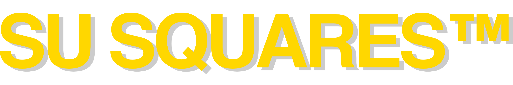

### All core devs (main protocol calls)

---

### Sponsor: [Su Squares](https://tenthousandsu.com)

  

The Su Squares NFT project from 2018 is a demonstration of how NFTs can be used for things other than profile photos.

Cute 10×10 pixel squares that you own and personalize. On-chain. Still minting.

Created by Su & William Entriken, lead author of the ERC-721 document. We are proud to sponsor abcoathup and this pioneering ethdevnews project, keep it up!

Follow [@SuSquares](https://x.com/susquares) [@fulldecent](https://x.com/fulldecent), Visit [tenthousandsu.com](https://tenthousandsu.com)

---

---

### Paid Listings

* self-custody. onchain tools. no bs. [@90secondscrypto on YouTube](https://www.youtube.com/@90secondscrypto)

[*Listings*](https://ethdevnews.com/about/#paid-listings)*: $100 in ETH/USDC (max 70 characters).  Email abcoathup at gmail*

---

---

*Publisher: [@abcoathup](https://x.com/abcoathup)*  
*Permalink: [ethdevnews.com/ethdevnews-weekly-2](https://ethdevnews.com/ethdevnews-weekly-2)*  
*Extend ethdevnews limited run via [sponsorships](https://ethdevnews.com/about/#sponsorships), [paid listings](https://ethdevnews.com/about/#paid-listings), [grants](https://ethdevnews.com/about/#grants) & [donations](https://ethdevnews.com/about/#donations).*  

---
