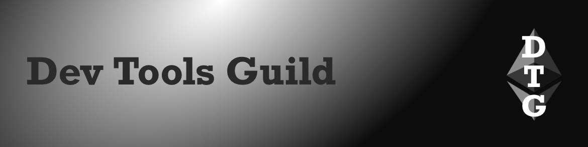

“writing code, without ill-intent, is not a crime”, ETHConf New York June 2026, EF Protocol AMA

### All core devs (main protocol calls)

#### All core devs \- consensus (ACDC) [\#163](https://ethereum-magicians.org/t/all-core-devs-consensus-acdc-163-august-21-2025/25104/2)

* [Fusaka](https://forkcast.org/upgrade/fusaka) upgrade:  
  * [Fusaka-devnet-3](https://fusaka-devnet-3.ethpandaops.io/): non finality testing
  * Fusaka-devnet-5: launch early September once client teams have [merged to trunk branches](https://github.com/ethpandaops/fusaka-devnets/blob/master/ansible/inventories/devnet-3/group_vars/all/images.yaml#L1-L19) 
* [Glamsterdam](https://forkcast.org/upgrade/glamsterdam) upgrade:  
  * Targeting June 2026  
  * Headliners: [EIP7732](https://forkcast.org/upgrade/glamsterdam#eip-7732) ePBS (consensus layer) & [EIP7928](https://forkcast.org/upgrade/glamsterdam#eip-7928) Block-level Access Lists (execution layer)  
  * [Non-headliner EIPs can be proposed for inclusion](https://eips.ethereum.org/EIPS/eip-7773#proposed-for-inclusion), deadline is Fusaka mainnet releases (\~October)

#### All core devs \- testing (ACDT) [\#49](https://ethereum-magicians.org/t/all-core-devs-testing-acdt-49-aug-18-2025/25078/3)

* Gas limit: some concerns about increasing from 45M to 60M pre-Fusaka

### Layer 1

* [EF Protocol AMA](https://blog.ethereum.org/2025/08/15/protocol-ama) August 29 on Reddit, [submit questions](https://docs.google.com/forms/d/e/1FAIpQLSfLxkF5UIKVDmcX0cOL3rhS5374XwJLzbF0_t-KHN77WxipiQ/viewform) in advance  
* Consensus-specs [v1.6.0-alpha.5](https://github.com/ethereum/consensus-specs/releases/tag/v1.6.0-alpha.5): rebase EIP7732 ePBS & EIP7805 FOCIL on Fulu  
* Ameen Soleimani: [EIP7805 FOCIL regulatory risk](https://x.com/ameensol/status/1958781727767412816) for validators & core devs  
* Post Quantum interop [\#6](https://github.com/leanEthereum/pm/blob/main/breakout-rooms/leanConsensus/pq-interop/meetings/meeting-06.md): devnet-0 interop targeting late September  
* EIPs (Ethereum improvement proposals):  
  * Meta [EIP8007](https://github.com/ethereum/EIPs/pull/10206/files): Glamsterdam gas repricings  
  * Feedback wanted on [EIP improvement process](https://x.com/poojaranjan19/status/1958564685961171245)

### Staking

* Preston Van Loon: [validator exit/entry queue](https://x.com/preston_vanloon/status/1956849021706015008) explainer  
* [Client diversity](https://clientdiversity.org/#distribution):  
  * Consensus layer: Lighthouse 42.7%  
  * Execution layer: Geth \~41%, Nethermind \~38% (estimated from self reports)  
* [Staking marketshare](https://dune.com/hildobby/eth2-staking): Lido 24.4%  
* [Kraken validators](https://x.com/ssv_network/status/1958554382045175870) all running on distributed validator technology (DVT)  
* Client releases:  
  * Consensus layer:  
    * Grandine [1.1.4](https://github.com/grandinetech/grandine/releases/tag/1.1.4): optimizations & fixes

### Layer 2

* Spire [Pylon](https://x.com/Spire_Labs/status/1957804832276038080): launch based appchains with synchronous reads  
* [HPP](https://x.com/aergo_io/status/1957321730386702544) (Arbitrum Orbit L2) live, focused on AI agents  
* L2Beat [ZK Catalog](https://x.com/l2beat/status/1958510175100289308): adds evaluation of ZK proving systems trusted setups  
* Gelato proposes [Ethereum settlement score](https://ethresear.ch/t/ethereum-settlement-score-ess-revitalizing-the-rollup-centric-roadmap/22922) (ESS): metric of L2 utilization of L1 security

### Research

* [WHIR](https://ethresear.ch/t/whir-for-ethereum/22938): recursive hash-based proximity testing for constrained Reed–Solomon codes; offers small proofs, fast verification & low memory usage  
* [Validator key management](https://ethresear.ch/t/ethereum-validator-key-management-via-ddh-based-exponent-verifiable-random-functions-evrf/22948) using DDH-based exponent VRFs

---

### Sponsor: [Dev Tools Guild](https://devtoolsguild.xyz)

  

The Dev Tools Guild unites critical Ethereum developer tooling to collectively fund projects and their maintainers (think Protocol Guild but for dev tooling), and boost coordination between protocol and dev tools developers. 

Member projects:

* **Smart contract languages**: Solidity & Vyper  
* **Client libraries**: alloy, ethers.js, Nethereum, viem, web3.py & Web3j  
* **Frameworks and developer environments**: Ape, Foundry & Scaffold-ETH  
* **Standardization tooling**: Sourcify

Follow [@devtoolsguild](https://x.com/devtoolsguild), Visit [devtoolsguild.xyz](http://devtoolsguild.xyz), Fund at [donate.devtoolsguild.eth](https://devtoolsguild.xyz/donate)

---

### Ecosystem

* ETHGlobal:  
  * New York [hackathon finalists](https://x.com/ETHGlobal/status/1957171057363919036)  
  * [ETHConf](https://ethconf.com/): community conference in New York, June 2026  
* Bob Summerwill: [early days of Ethereum](https://www.earlydaysofeth.org/)  
* ETH metrics:  
  * [Gas](https://ultrasound.money/#gas) (gwei): 0.4 average, 0.1 \- 7.5 (16.3 for zero net issuance)  
  * [ETH supply change](https://ultrasound.money/): 18k net issuance  
  * [ETHUSD](https://www.coingecko.com/en/coins/ethereum): $4,081 \- $4,646 (all time high $4,878, November 10, 2021\)  
  * [ETH ETFs](https://dune.com/hildobby/eth-etfs): 5% of ETH supply  
  * [ETHBTC](https://ratiogang.com/): 0.038 (0.165 for the Flippening)

### Developers

* Hardhat 3 [encrypted secrets keystore](https://blog.nomic.foundation/how-to-manage-config-values-and-secrets-safely-in-hardhat-3/) guide  
* OpenZeppelin community contracts (Solidity library): [ERC7579 modular smart accounts](https://docs.openzeppelin.com/community-contracts/0.0.1/account-modules)  
* Solady (Solidity library) [safeMoveETH](https://x.com/optimizoor/status/1957444496616263756): move ETH using SELFDESTRUCT  
* [Sign in with Ethereum](https://siwe.xyz/) info website & documentation  
* Echidna (fuzzer): [symbolic execution](https://gustavo-grieco.github.io/blog/echidna-symexec/) in verification or exploration mode  
* Optimism: [deploy a local OP Stack testnet](https://localchain.optimism.io/)  
* Toni Wahrstätter [transaction tracer](https://github.com/nerolation/eth-transaction-simulatoor#readme) (Python): simulate transactions before broadcasting  
* Otterscan [v2.10.0](https://github.com/otterscan/otterscan/releases/tag/v2.10.0) (local block explorer): local contract verification  
* ERCs (application layer standards):  
  * [ERC8006](https://github.com/ethereum/ERCs/pull/1179/files): Universal policy engine  
  * [ERC8009](https://github.com/ethereum/ERCs/pull/1184/files): Proxy clear signing  
  * [ERC8010](https://github.com/ethereum/ERCs/pull/1186/files): Signature verification for pre-delegated accounts

### Security

* Security Alliance (SEAL): [domain hijacking advisory](https://www.securityalliance.org/news/2025-08-advisory-domain-hijacking)  
* EF trillion dollar security project [phase 2](https://blog.ethereum.org/2025/08/20/trillion-dollar-sec-2): plans for a wallet minimum security standard, improving blind signing & contract vulnerability database

### Enterprise

* Singapore’s [DBS Bank](https://www.dbs.com/newsroom/DBS_expands_blockchain_capabilities_by_tokenising_and_distributing_structured_notes) to tokenise structured notes

### Applications

* Ethereum.org [application explorer](https://ethereum.org/en/apps/): curated list of apps  
* Safe [Fiducia](https://safe.global/blog/safe-research-fiducia-onchain-trust-rules-and-cosigning): enforce transaction rules with option for a cosigner  
* [Circle Gateway](https://www.circle.com/blog/circle-gateway-redefining-crosschain-ux): unified crosschain USDC balance
* Wyoming stable token commission: [Frontier stable token](https://stabletoken.wyo.gov/pages/FRNT) (FRNT) deployed on mainnet, Arbitrum, Base & Optimism, using LayerZero, not purchasable until September

### Regulation

* US acting assistant attorney general: “[writing code, without ill-intent, is not a crime](https://www.justice.gov/opa/speech/acting-assistant-attorney-general-matthew-r-galeotti-delivers-remarks-american)”  
  * [Free Roman Storm](https://freeromanstorm.com/)  
* US Federal Reserve [sunsetting novel activities supervision program](https://www.federalreserve.gov/newsevents/pressreleases/bcreg20250815a.htm), will monitor banks crypto activities through standard supervisory process

---

### Paid Listings

* self-custody. onchain tools. no bs. [@90secondscrypto on YouTube](https://www.youtube.com/@90secondscrypto)  
* [abcoathup](https://x.com/abcoathup/status/1955784034711429264) seeks paid work.  DM to chat

[*Listings*](https://ethdevnews.com/about/#paid-listings)*: $100 in ETH/USDC (max 70 characters).  Email abcoathup at gmail*  

---

### General

* Bullish received [$1.15B of IPO proceeds in stablecoins](https://bullish.com/news-insights/news/bullish-receives-1-15bn-of-ipo-proceeds-in-stablecoins/)  
* Veridise [LLZK](https://veridise.com/blog/veridise-announcements/announcing-llzk-a-unified-open-source-intermediate-representation-ir-for-zero-knowledge-languages/): intermediate representation (IR) for zero-knowledge languages  
* Trail of Bits: [exploit AI via image scaling](https://blog.trailofbits.com/2025/08/21/weaponizing-image-scaling-against-production-ai-systems/)

---

*Publisher: [@abcoathup](https://x.com/abcoathup)*  
*Permalink: [ethdevnews.com/ethdevnews-weekly-3](https://ethdevnews.com/ethdevnews-weekly-3)*  
*Extend ethdevnews limited run via [sponsorships](https://ethdevnews.com/about/#sponsorships), [paid listings](https://ethdevnews.com/about/#paid-listings), [grants](https://ethdevnews.com/about/#grants) & [donations](https://ethdevnews.com/about/#donations).*  

---