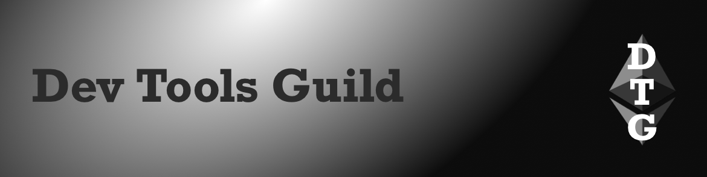

Fusaka mainnet upgrade potentially in December, US GDP onchain, r/Ethereum AMAs with builders

### All core devs (main protocol calls)

#### All core devs \- execution (ACDE) [\#219](https://ethereum-magicians.org/t/all-core-devs-execution-acde-219-august-28-2025/25106/2)

* [Fusaka](https://forkcast.org/upgrade/fusaka) upgrade (targeting 2025):  
  * Mainnet upgrade potentially in December if testing goes well, timeline based on [upgrade process](https://github.com/ethereum/pm/blob/master/processes/protocol-upgrade.md) (30 days between client releases & first testnet and 30 days between last testnet & mainnet);  Checking with L2s & infrastructure teams on timing requirements  
  * [Fusaka-devnet-3](https://fusaka-devnet-3.ethpandaops.io/): syncing issues during non-finality testing, retest once fixed, consensus layer client teams need to [merge to trunk branches](https://github.com/ethpandaops/fusaka-devnets/blob/master/ansible/inventories/devnet-3/group_vars/all/images.yaml#L1-L9), can then launch Fusaka-devnet-5  
* Holešky testnet will be deprecated after upgrading to Fusaka  
* Gas limit [blockers](https://github.com/NethermindEth/eth-perf-research/blob/main/README.md#60-mgas) for increasing to 60M (up from 45M)  
* [Glamsterdam](https://forkcast.org/upgrade/glamsterdam) upgrade (targeting June 2026):  
  * Headliners: [EIP7732](https://forkcast.org/upgrade/glamsterdam#eip-7732) ePBS (consensus layer) & [EIP7928](https://forkcast.org/upgrade/glamsterdam#eip-7928) Block-level Access Lists (execution layer)  
  * Non-headliner EIPs are being [proposed for inclusion](https://forkcast.org/upgrade/glamsterdam#proposed-for-inclusion):   
    * Deadline for proposals is Fusaka mainnet releases  
    * Client teams can specify EIPs they want more info on (e.g. [Besu](https://github.com/ethereum/pm/issues/1687#issuecomment-3233422166))  
    * Discussed: [Meta EIP8007](https://github.com/ethereum/EIPs/pull/10206/files) gas repricings, [EIP2926](https://forkcast.org/upgrade/glamsterdam#eip-2926) chunk-based code Merkleization ([presentation](https://notes.ethereum.org/@gballet/S1dS-qGLxg#/)), [EIP7843](https://forkcast.org/upgrade/glamsterdam#eip-7843) SLOTNUM opcode, [EIP7793](https://forkcast.org/upgrade/glamsterdam#eip-7793) conditional transactions, [EIP8012](https://github.com/ethereum/EIPs/pull/10218/files) generalized consolidation requests & [EIP8014](https://github.com/ethereum/EIPs/pull/10220/files) builder generalized consolidation requests

#### All core devs \- testing (ACDT) [\#50](https://ethereum-magicians.org/t/all-core-devs-testing-acdt-50-aug-25-2025/25152/2)

### Layer 1

* Ethereum Foundation:  
  * [EF Protocol AMA](https://www.reddit.com/r/ethereum/comments/1n1cyd3/ama_we_are_ef_protocol_pt_14_29_august_2025/) on Reddit  
  * Protocol update [\#2](https://blog.ethereum.org/2025/08/22/protocol-update-002) (blob scaling): Blob Parameter Only (BPO) upgrades after Fusaka can increase blobs up to 8x, future scaling via PeerDAS v2, blobpool scaling & FullDAS  
* [Glamsterdam](https://forkcast.org/upgrade/glamsterdam) upgrade:  
  * \[Headliner\] EIP7928 Block-level Access Lists breakout [\#1](https://ethereum-magicians.org/t/eip-7928-breakout-1-august-27-2025/25145): client teams started implementing  
  * \[Considered for Inclusion\] EIP7805 FOCIL breakout [\#18](https://ethereum-magicians.org/t/focil-breakout-18-august-26-2025/25248/2): rebasing onto Fulu & adding metrics  
* Anders Elowsson: [generalized blob base fee update fraction calculation](https://ethresear.ch/t/generalized-base-fee-update-fraction/22988)  
* Ethproofs call [\#4](https://x.com/corcoranwill/status/1958965472734355840): $1M proximity prize to prove/disprove Reed-Solomon proximity gaps conjectures & proof status monitoring  
* PQ Interop [\#6](https://github.com/leanEthereum/pm/blob/main/breakout-rooms/leanConsensus/pq-interop/meetings/meeting-06.md)  
* Stateless implementers call [\#41](https://stateless.fyi/development/sic-calls/history.html#call-41-august-25-2025)  
* Shipyard [libp2p libraries](https://ipshipyard.com/blog/2025-libp2p-maintenance-update/) (go-libp2p & js-libp2p) transitioning to community maintainers  
* EIPs (Ethereum improvement proposals):  
  * [EIP8011](https://github.com/ethereum/EIPs/pull/10214/files): Multidimensional gas metering  
  * [EIP8012](https://github.com/ethereum/EIPs/pull/10218/files): Generalized consolidation requests  
  * [EIP8013](https://github.com/ethereum/EIPs/pull/10219/files): Static relative jumps and calls for the EVM  
  * [EIP8014](https://github.com/ethereum/EIPs/pull/10220/files): Builder generalized consolidation requests  
  * [EIP8015](https://github.com/ethereum/EIPs/pull/10221/files): Remove legacy deposit and eth1data fields  
  * [EIP8016](https://github.com/ethereum/EIPs/pull/10234/files): SSZ CompatibleUnion

### Staking

* beaconcha.in [validator dashboard v2](https://beaconcha.in/dashboard#summary): no longer in beta  
* Obol Charon [v1.6.0](https://github.com/ObolNetwork/charon/releases/tag/v1.6.0) (distributed validator): QUIC support (alpha)  
* [Client diversity](https://clientdiversity.org/#distribution):  
  * Consensus layer: Lighthouse 42.7%  
  * Execution layer: Geth \~41%, Nethermind \~38% (estimated from self reports)  
* [Staking marketshare](https://dune.com/hildobby/eth2-staking): Lido 24.3%  
* Client releases:  
  * Execution layer:  
    * Besu [25.8.0](https://github.com/hyperledger/besu/releases/tag/25.8.0): faster sync using less memory & CPU and faster block creation

### Layer 2

* L2Beat [native rollups book](https://native-rollups.l2beat.com/): includes EXECUTE precompile draft spec  
* [Synchronous composability protocol](https://ethresear.ch/t/scope-synchronous-composability-protocol-for-ethereum/22978) (SCOPE): push-based synchronous crosschain function calls, proof of concept

---

### Sponsor: [Dev Tools Guild](https://devtoolsguild.xyz)

  

The Dev Tools Guild unites critical Ethereum developer tooling to collectively fund projects and their maintainers (think Protocol Guild but for dev tooling), and boost coordination between protocol and dev tools developers. 

Member projects:

* **Smart contract languages**: Solidity & Vyper  
* **Client libraries**: alloy, ethers.js, Nethereum, viem, web3.py & Web3j  
* **Frameworks and developer environments**: Ape, Foundry & Scaffold-ETH  
* **Standardization tooling**: Sourcify

Follow [@devtoolsguild](https://x.com/devtoolsguild), Visit [devtoolsguild.xyz](http://devtoolsguild.xyz), Fund at [donate.devtoolsguild.eth](https://devtoolsguild.xyz/donate)

---

### Ecosystem

* Upcoming [AMAs with builders](https://x.com/BSmokes_/status/1960124438231253102) on r/Ethereum subreddit  
* ETH metrics:  
  * [Gas](https://ultrasound.money/#gas) (gwei): 0.7 average, 0.1 \- 21.3 (16.3 for zero net issuance)  
  * [ETH supply change](https://ultrasound.money/): 18k net issuance  
  * [ETHUSD](https://www.coingecko.com/en/coins/ethereum): $4,250 \- $4,926 (all time high $4,946, August 24, 2025\)  
  * [ETH ETFs](https://dune.com/hildobby/eth-etfs): 5.1% of ETH supply  
  * [ETHBTC](https://ratiogang.com/): 0.039(0.165 for the Flippening)

### Developers

* [Argot collective](https://github.com/argotorg): GitHub repos migrated for Solidity, Sourcify, Fe, ethdebug, Act & hevm   
* ERC7955 permissionless CREATE2 factory [explainer](https://safe.global/blog/safe-research-meet-erc-7955-no-private-key-required) & [deployment tool](https://www.safe.dev/erc-7955/)  
* RareSkills: [predict contract addresses](https://rareskills.io/post/ethereum-address-derivation) (deployed via EOAs, CREATE & CREATE2)  
* Sign in with Ethereum (SIWE): [message validator](https://docs.siwe.xyz/validator/) & [ecosystem site](https://siwe.xyz/ecosystem)  
* Ethereum Community Foundation:  
  * BlobKit [v2](https://x.com/ethcforg/status/1960736886168948855) (TypeScript): runs in browser & Node.js  
  * [BETH](https://ethcf.org/introducing-beth-eths-proof-of-burn-token/): burn ETH to mint BETH ERC20 tokens  
* Paul Miller noble [v2](https://x.com/paulmillr/status/1960041074497339613) (JavaScript): [ciphers](https://github.com/paulmillr/noble-ciphers/releases/tag/2.0.0), [curves](https://github.com/paulmillr/noble-curves/releases/tag/2.0.0), [hashes](https://github.com/paulmillr/noble-hashes/releases/tag/2.0.0), [post-quantum](https://github.com/paulmillr/noble-post-quantum/releases/tag/0.5.1), pure ESM, smaller package & disk sizes  
* [VSDeer](https://vsdeer.soldeer.xyz/): VS Code extension security scanner & sandboxing guide

### Enterprise

* US Department of Commerce: [Q2 gross domestic product posted onchain](https://www.commerce.gov/news/press-releases/2025/08/department-commerce-posts-2nd-quarter-gross-domestic-product-blockchain), including on [mainnet](https://etherscan.io/address/0x36ccdF11044f60F196e981970d592a7DE567ed7b#code), [Arbitrum](https://arbiscan.io/address/0x36ccdF11044f60F196e981970d592a7DE567ed7b#code) & [Optimism](https://optimistic.etherscan.io/address/0x36ccdF11044f60F196e981970d592a7DE567ed7b#code) with document hash & amount

### Applications

* Aave [Horizon](https://aave.com/blog/horizon-launch): institutional investors can borrow stablecoins against real-world assets  
* [EulerEarn](https://euler.finance/blog/introducing-eulerearn-passive-yield-professionally-curated): passive yield, deposits aggregated across ERC4626 strategies  
* Fileverse dSheets [Tally integration](https://x.com/fileverse/status/1958901545732338075) to track DAO proposals, votes & deadlines  
* MetaMask [social login](https://metamask.io/news/introducing-metamask-social-login) using Google/Apple ID \+ password  
* Safe [shared address book](https://help.safe.global/en/articles/381248-spaces-shared-address-book)  
* Micah Zoltu’s [crowdsourcer](https://medium.com/@lituusfoundation/micahs-augur-fork-0a1494868d97): attempt to trigger Augur fork

### Regulation

* DeFi Education Fund [letter to congress wanting protections](https://www.defieducationfund.org/post/def-110-partners-submit-coalition-letter-on-developer-protections-in-market-structure) for software developers & non-custodial service providers  
  * [Free Roman Storm](https://freeromanstorm.com/)  
* CFTC [foreign board of trade (FBOTs) registration](https://www.cftc.gov/PressRoom/PressReleases/9111-25) for exchanges outside US wanting to serve US customers

---

### Paid Listings

* [abcoathup](https://x.com/abcoathup/status/1955784034711429264) seeks paid work.  DM to chat
* Use [ERC4883](https://ethereum-magicians.org/t/erc-4883-composable-svg-nft/8765) to create composable SVG NFTs  

[*Listings*](https://ethdevnews.com/about/#paid-listings)*: $100 in ETH/USDC (max 70 characters).  Email abcoathup at gmail*  

---

### General

* Yet another upcoming alt-L1: [Google Cloud universal ledger](https://www.linkedin.com/feed/update/urn:li:activity:7366124738848415744/) (GCUL)  
* [Nx](https://github.com/nrwl/nx/security/advisories/GHSA-cxm3-wv7p-598c) (build platform): malicious versions used AI prompt to scan files for secrets & publish as a GitHub repo  
* Apple [ImageIO out-of-bounds write vulnerability](https://thehackernews.com/2025/08/apple-patches-cve-2025-43300-zero-day.html) used in targeted attacks

---

*Publisher: [@abcoathup](https://x.com/abcoathup)*  
*Permalink: [ethdevnews.com/ethdevnews-weekly-4](https://ethdevnews.com/ethdevnews-weekly-4)*  
*Extend ethdevnews limited run via [sponsorships](https://ethdevnews.com/about/#sponsorships), [paid listings](https://ethdevnews.com/about/#paid-listings), [grants](https://ethdevnews.com/about/#grants) & [donations](https://ethdevnews.com/about/#donations).* 